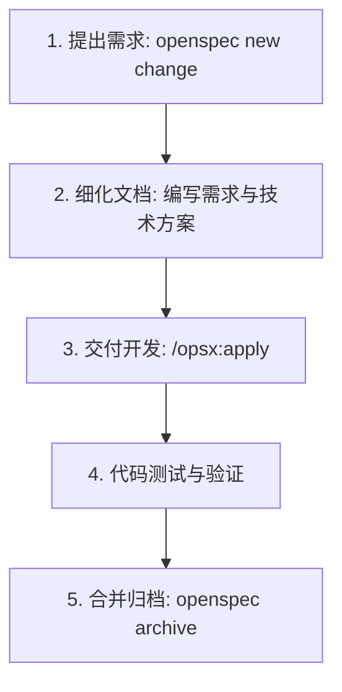

# Vortex Downloader - OpenSpec 开发与规范指南

本项目已全面接入 **OpenSpec 规范驱动开发 (Spec-Driven Development, SDD)** 体系。本指南用于规范团队成员及 AI 编程助手（如 Antigravity, Cursor, Claude Code, Windsurf 等）在开发新功能或修复 Bug 时的需求文档编写与开发流程。

---

## 📂 项目中的 OpenSpec 目录结构

*   **[`openspec/`](file:///f:/github/yt-dlp/openspec/)**：核心规范文件夹。
    *   `config.yaml`：OpenSpec 配置文件（采用 `spec-driven` 流程架构）。
    *   `changes/`：存放处于开发中的临时需求提案（Proposals）。
    *   `specs/`：存放已被合并归档的系统主设计规范（System Baseline Specs）。
*   **[`.agent/`](file:///f:/github/yt-dlp/.agent/) / [`.cursor/`](file:///f:/github/yt-dlp/.cursor/)**：AI 助手的交互命令配置。内置了 `/opsx:propose`、`/opsx:apply` 等快捷指令的 Prompt 技能定义。

---

## 🔄 规范化三步开发工作流

在进行任何功能开发或 Bug 修复时，请严格遵守 **提案 (Propose) -> 开发 (Apply) -> 归档 (Archive)** 流程：



### 第一步：创建需求提案 (Propose)
每当有新的功能想法或需要修复的 Bug，首先在终端运行：
```bash
npx @fission-ai/openspec@latest new change "your-change-name"
```
*例如：`npx @fission-ai/openspec@latest new change "add-download-speed-limit"`*

*   **输出**：会在 `openspec/changes/your-change-name/` 目录下生成三个核心文件：
    *   `proposal.md`：记录此次需求的**背景、功能目标、技术方案、受影响的文件列表**。
    *   `spec.md`：使用 BDD (Given-When-Then) 格式记录**功能行为的用例约束**。
    *   `tasks.md`：功能拆分出的具体**任务核对清单 (Todo List)**。
*   **操作**：您可以使用中文在这些文件里补充需求细节，也可以让 AI 助手帮您细化这些规范。

### 第二步：交付 AI 开发 (Apply)
需求文档定义清楚后，向您的 AI 助手发送指令：
*   **指令**：在 AI 对话框中输入 `/opsx:apply` 并选择您的提案目录，或在普通对话中输入：
    > 请阅读 `openspec/changes/your-change-name/` 下的需求说明，并严格按照其方案和 tasks.md 任务清单实现代码。
*   **要求**：AI 将会严格锁定在提案范围内进行开发，禁止超出范围修改无关代码，以保证代码的安全性和准确性。

### 第三步：合并归档 (Archive)
代码编写完毕并通过本地测试后（前端构建成功且 GUI 启动无误），执行归档操作：
```bash
npx @fission-ai/openspec@latest archive "your-change-name"
```
*   **效果**：当前的临时需求提案会被标记为已完成并归档；同时，本次改动的核心规范会自动合并更新至 `openspec/specs/` 的系统主设计规范中。
*   **意义**：保证项目文档永远与真实代码保持 100% 同步，任何新加入的开发者（或新开启的 AI 会话）只要阅读 `openspec/specs/` 就能立刻掌握系统目前支持的所有功能细节。

---

## ⚠️ 针对本项目的开发铁律

1.  **前端资源必须编译**：本项目的前端使用 React，生产环境由 Python `web_server.py` 直接挂载 `web/dist` 下的编译产物。**每次修改 React 界面代码后，必须在 `web` 目录下执行 `npm run build`**，并将打包后的文件随代码一起提交，否则桌面端不会生效。
2.  **绝对禁止提交 Cookie**：任何情况下都**严禁**将用户的 `cookies.txt` 或测试产生的临时 Cookie 文件提交到 Git。根目录下的 `.gitignore` 已配置了防范规则，请勿使用 `git add -f` 强制提交此类文件。
3.  **上游 master 同步**：本地保持官方 `yt-dlp` 的 `master` 分支用于拉取上游最新破译规则，您的 GUI 业务开发全部在您的专属分支（如 `my-local-webui` 或 `main`）上进行，并通过合并（merge）来吸收上游代码。
